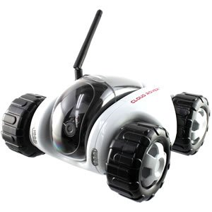

# KiepRover
### A C# WPF application for CloudRover wifi RC car
This application is a fullscreen UI to drive around with the CloudRover wifi RC cars, that can be bought for about €65.

Features:
- Show fullscreen video feed
- Drive with keyboard arrow keys
- Camera up/down with page up and page down keys, or A and Z
- Turn infrared LEDs on/off with S and X
- Turn other LEDs on/off with D and C
- Automatically connects to CloudRover wifi access point (running inside the car)
- Show battery level and wifi range level
 
Research & reverse engineering information can be found [here](Research/)

See [KiepProjects](https://github.com/Joozt/KiepProjects) for an overview of all Kiep projects.
